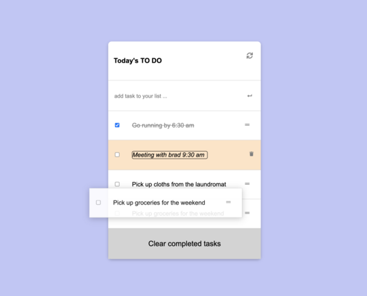

# A Todo App

"To-do list" is a tool that helps to organize your day. It simply lists the things that you need to do and allows you manage them too!

In this project, you will get a simple HTML list of To Do tasks. It is built using webpack and served by a webpack dev server. The list is styled according to the specifications listed by the minimalist website.

The CRUD (create, update, delete) methods for the todo tasks are implemented. All the elements of the user interface are fully functional and the application is completed. You will also be able to mark task completion by selecting the corresponding checkbox (or undo it by unchecking the checkbox). The updated tasks list will be stored in localstorage.

## Built With

- HTML
- CSS
- JavaScript
- HTML & CSS & JavaScript Linters
- GIT
- ES6
- WebPack

[LIVE DEMO LINK](https://clintonjosephs.github.io/to-do-list/)

## Set up locally

- Open your terminal and run the following command: git clone https://github.com/clintonjosephs/to-do-list.git
- Run the command "npm install"
- Run the command "npm run build"
- Run the command "npm run start"

Once you completed this steps you should see the app running at: http://localhost:8080/ in your browser.

## Author

👤 **Clinton Mbonu**

- Location: Nigeria
- GitHub: [@clintonjosephs](https://github.com/clintonjosephs)
- Twitter: [@clintonmbonu\_](https://twitter.com/clintonmbonu_)
- LinkedIn: [LinkedIn](https://linkedin.com/in/clinton-mbonu)

## 🤝 Contributing

Contributions, issues, and feature requests are welcome!

Feel free to check the [issues page](../../issues/).

## Show your support

Give a ⭐️ if you like this project!

## Acknowledgments
- Minimlistic Website
- Entire Microverse community

## 📝 License

This project is [MIT](./MIT.md) licensed.