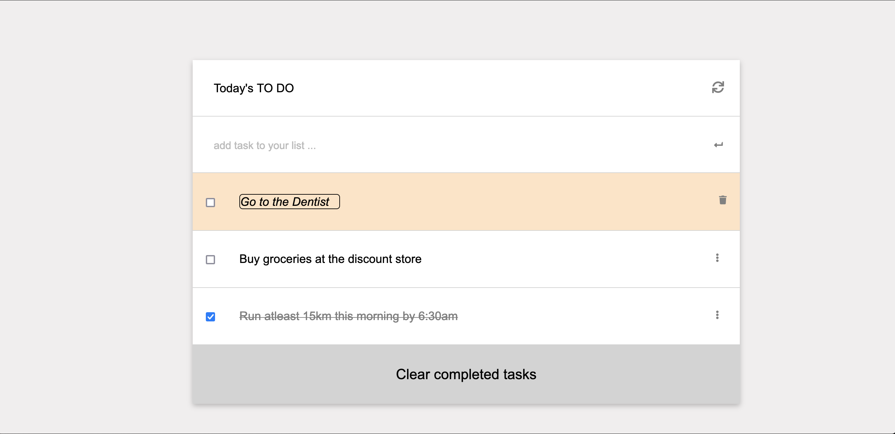

# To-do list

"To-do list" is a tool that helps to organize your day. It simply lists the things that you need to do and allows you to mark them as complete. This simple website allows for doing that!

## Built With

- HTML
- CSS
- Javascript
- HTML& CSS & Javaascript Linters
- Git
- Es6
- WebPack

[LIVE DEMO LINK](Coming soon)

## Get Started

Please get your browser update.
To get a local copy up and running follow these simple steps.

Run the command below from the Terminal:

      git clone <URL> in your terminal

      cd to-do-list

      Run npm install to install dependecies

      start index.html

## Authors

👤 **Clinton Mbonu**

- Location: Nigeria
- GitHub: [@clintonjosephs](https://github.com/clintonjosephs)
- Twitter: [@clintonmbonu\_](https://twitter.com/clintonmbonu_)
- LinkedIn: [LinkedIn](https://linkedin.com/in/clinton-mbonu)

## 🤝 Contributing

Contributions, issues, and feature requests are welcome!

## Show your support

Give a ⭐️ if you like this project!

## Acknowledgments

Microverse Community

## 📝 License

This project is [MIT](LICENSE) licensed.
